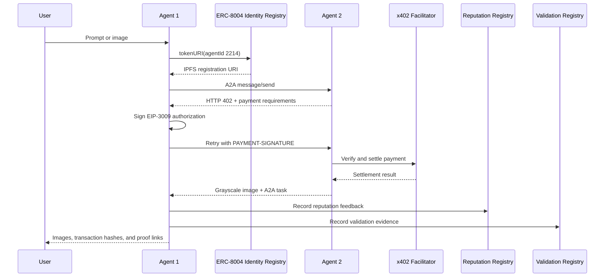

# ERC-8004 + x402 Agent Demo

A production-style reference implementation of two autonomous agents interacting through open protocols. Agent 1 discovers Agent 2 through the ERC-8004 Identity Registry, negotiates and signs a USDC payment through x402, receives an A2A result, and records reputation and validation evidence on Base Sepolia.

## Live demo

**[Open the complete ERC-8004 + x402 agent pipeline →](https://erc8004-agent-demo-five.vercel.app/)**

[Agent #2214](https://sepolia.basescan.org/token/0x8004A818BFB912233c491871b3d84c89A494BD9e/instance/2214) · [ERC-8004 contracts](https://github.com/erc-8004/erc-8004-contracts)

> This project uses testnet assets only. The $0.01 payment is real Base Sepolia USDC, but it has no mainnet value.

## What this project demonstrates

- On-chain agent identity and endpoint discovery through ERC-8004.
- Agent-to-agent JSON-RPC messaging using A2A `message/send`.
- HTTP-native payment negotiation using x402 v2 and EIP-3009 authorization.
- Real testnet USDC settlement on Base Sepolia.
- ERC-8004 reputation feedback linked to A2A and payment evidence on IPFS.
- ERC-8004 validation requests and responses tied to input/output hashes.
- A browser demo, a CLI client, a standalone paid agent service, and automated tests.
- Deployment hardening for Vercel and Railway, including health checks, access control, rate limiting, and secret-safe readiness reporting.

## End-to-end flow

The hosted web application uses an embedded, same-origin Agent 2 endpoint for deployment resilience. The CLI path can perform canonical on-chain discovery and call the endpoint stored in the agent registration file.

## Components

| Component | Role | Key technologies |
| --- | --- | --- |
| `frontend/` | Interactive portfolio demo and server-side orchestration | Express, SSE, OpenAI Images, viem, sharp |
| `image-generator/` | Agent 1 CLI | TypeScript, A2A, x402 client, GPT Image 2 |
| `colorizer-service/` | Standalone Agent 2 | A2A, MCP, x402 middleware, sharp |
| `erc8004/` | Identity, discovery, reputation, and validation tooling | viem, IPFS/Pinata, Base Sepolia |
| `tests/` | Protocol, schema, security, and deployment regressions | Bun test |

## Registered agents

### Agent 2 — Colorizer Service

| Field | Value |
| --- | --- |
| Agent ID | `2214` |
| Identifier | `eip155:84532:0x8004A818BFB912233c491871b3d84c89A494BD9e/2214` |
| Registration file | [IPFS](https://gateway.pinata.cloud/ipfs/bafkreih6km34e3itewqpt3djsevqesxa2sfuqwtlvs3c6qj5mafxk3oeya) |
| NFT | [BaseScan](https://sepolia.basescan.org/token/0x8004A818BFB912233c491871b3d84c89A494BD9e/instance/2214) |
| Capability | Convert JPEG, PNG, WebP, or AVIF input to grayscale PNG |
| Price | $0.01 USDC on Base Sepolia |

### Agent 1 — Image Generator

| Field | Value |
| --- | --- |
| Agent ID | `2215` |
| Identifier | `eip155:84532:0x8004A818BFB912233c491871b3d84c89A494BD9e/2215` |
| Registration file | [IPFS](https://gateway.pinata.cloud/ipfs/bafkreidvz2xz3aiudzmcxw4k4vh3crxotzmteq2m3vs7zykhyxndvt7j34) |
| Capability | Generate an image, purchase processing, and submit proof records |

## ERC-8004 contracts

All contracts are deployed on Base Sepolia (`chainId 84532`).

| Registry | Address |
| --- | --- |
| Identity | [`0x8004A818BFB912233c491871b3d84c89A494BD9e`](https://sepolia.basescan.org/address/0x8004A818BFB912233c491871b3d84c89A494BD9e) |
| Reputation | [`0x8004B663056A597Dffe9eCcC1965A193B7388713`](https://sepolia.basescan.org/address/0x8004B663056A597Dffe9eCcC1965A193B7388713) |
| Validation | [`0x8004Cb1BF31DAf7788923b405b754f57acEB4272`](https://sepolia.basescan.org/address/0x8004Cb1BF31DAf7788923b405b754f57acEB4272) |

The deterministic CREATE2 deployment uses the same registry addresses across supported EVM networks.

## Quick start

### Prerequisites

- Node.js 20 or newer.
- Bun 1.3.11 or newer for the test suite.
- An OpenAI API key with image-generation access.
- A Base Sepolia payer wallet funded with testnet ETH and USDC.
- A separate Agent 2 owner wallet if you want reputation and validation writes.
- A Pinata JWT if you want to publish evidence to IPFS.

### Install

    git clone https://github.com/hpo1o/erc8004-agent-demo.git
    cd erc8004-agent-demo
    npm run install:all

### Configure the CLI

Copy the example files:

    cp image-generator/.env.example image-generator/.env
    cp erc8004/.env.example erc8004/.env

At minimum, set these values in `image-generator/.env`:

| Variable | Purpose |
| --- | --- |
| `OPENAI_API_KEY` | Generates the source image with GPT Image 2 |
| `PAYER_PRIVATE_KEY` | Signs x402 USDC authorization and Agent 1 registry writes |
| `BASE_SEPOLIA_RPC` | Optional custom RPC; defaults to the public Base endpoint |
| `COLORIZER_URL` | Optional endpoint override; leave empty for ERC-8004 discovery |
| `PAYMENT_RECIPIENT_ADDRESS` | Required with a manual `COLORIZER_URL` override |

For a deterministic hosted call, set:

    COLORIZER_URL=https://erc8004-agent-demo-five.vercel.app/api/agent
    PAYMENT_RECIPIENT_ADDRESS=0x171c4E80E4cA6bBe95Eb38D9d226b52897350dBb

Leave `COLORIZER_URL` empty when you specifically want to demonstrate on-chain endpoint discovery.

### Run the CLI demo

    cd image-generator
    npm start "a golden retriever in a sunlit meadow"

The CLI writes the final image to `image-generator/output.jpg` and prints payment, reputation, and validation references.

## Run the web application locally

Copy `frontend/.env.example` to `frontend/.env`, provide the required values, and run:

    npm start --prefix frontend

Open [http://localhost:3001](http://localhost:3001). You can generate an image from a prompt or upload an existing image.

The upload path does not call OpenAI, but the paid Agent 2 request still requires `PAYER_PRIVATE_KEY`. Optional on-chain proof steps require `ERC8004_PRIVATE_KEY` and `PINATA_JWT`.

## Environment variables

| Variable | Required | Description |
| --- | --- | --- |
| `OPENAI_API_KEY` | Prompt mode | OpenAI API key with image-generation access |
| `OPENAI_IMAGE_MODEL` | No | Defaults to `gpt-image-2` |
| `PAYER_PRIVATE_KEY` | Paid flow | Agent 1 payer and validator key |
| `ERC8004_PRIVATE_KEY` | Proof writes | Agent 2 owner key |
| `PINATA_JWT` | Proof writes | Publishes reputation and validation evidence to IPFS |
| `BASE_SEPOLIA_RPC` | No | Custom Base Sepolia RPC URL |
| `PAYMENT_RECIPIENT_ADDRESS` | No | Agent 2 payment recipient; defaults to the registered wallet |
| `X402_FACILITATOR_URL` | No | Defaults to the public x402 facilitator |
| `SERVICE_ACCESS_TOKEN` | Recommended | Protects the expensive `POST /api/process` route |
| `PROCESS_RATE_LIMIT_MAX` | No | Per-IP request limit; defaults to 10 |
| `PROCESS_RATE_LIMIT_WINDOW_MS` | No | Rate-limit window; defaults to one hour |
| `ALLOW_LOCAL_COLORIZER_FALLBACK` | Development only | Enables a no-payment local fallback outside Vercel |

Never commit a populated `.env` file or use a wallet that controls production funds.

## Useful commands

| Command | Description |
| --- | --- |
| `npm run install:all` | Install dependencies for every package |
| `npm run typecheck` | Type-check all TypeScript packages |
| `npm test` | Run the complete Bun test suite |
| `npm run ci` | Run type-checking and tests |
| `npm run check --prefix erc8004` | Validate environment, balances, and wallet separation |
| `npm run discover --prefix erc8004` | Resolve Agent 2 through the Identity Registry |
| `npm run reputation --prefix erc8004 -- --agentId 2214` | Read on-chain reputation |
| `npm start --prefix frontend` | Start the portfolio web application |
| `npm start --prefix image-generator -- "a cat at sunset"` | Run Agent 1 from the CLI |

## Deployment

### Vercel

The recommended Vercel project setting is:

- Root Directory: `frontend`
- Framework Preset: Other
- Build Command: none
- Output Directory: none

Add the production environment variables, redeploy, and verify:

    https://<your-domain>/health

The health route reports only readiness booleans and never returns secret values.

A root-level `vercel.json` and compatibility entrypoints under `api/` are also included. They make existing Vercel projects work even when their Root Directory is left at the repository root.

### Railway

The standalone web service can also be deployed from `frontend/` with:

- Config file: `frontend/railway.json`
- Dockerfile: `frontend/Dockerfile`
- Health check: `/health`

See [docs/CUSTOM_DOMAIN.md](docs/CUSTOM_DOMAIN.md) for custom-domain and DNS guidance.

## Verification and proof

The repository includes immutable deployment evidence for the registered agents:

| Agent | Operation | Transaction |
| --- | --- | --- |
| Colorizer #2214 | `register()` | [BaseScan](https://sepolia.basescan.org/tx/0x1bd0e710e571e05a0b297ca9b7d48062b2da281deac64a18c9fb60d5fa8103d0) |
| Colorizer #2214 | `setAgentURI()` | [BaseScan](https://sepolia.basescan.org/tx/0x67e6bdbf6427b62e2b1484ab813729bc11d0048f64bb29fa904d5dcd73a16077) |
| Image Generator #2215 | `register()` | [BaseScan](https://sepolia.basescan.org/tx/0xce6a457ba9f6cb11d6e424afca4ba8e5f3d703f7d170a5f78e95211688f3c91c) |
| Image Generator #2215 | `setAgentURI()` | [BaseScan](https://sepolia.basescan.org/tx/0x9a816ba4dc40d25b6dc375efb86a9957f5d8a70350c9210a789ec4ce6bc6aae5) |

## Trust model and limitations

This project deliberately separates what is verifiable from what is illustrative:

- Identity, payment settlement, reputation writes, and validation records are on-chain.
- A2A payloads and detailed evidence are off-chain; their hashes and IPFS references can be anchored on-chain.
- The current validation response is signed by the payer. It is a reproducible attestation, not a zero-knowledge proof of computation.
- The image transformation itself is deterministic `sharp().grayscale()`, which makes independent re-execution straightforward.
- The public demo is testnet software, not an audited payment product.
- ERC-8004 forbids self-feedback. `PAYER_PRIVATE_KEY` and `ERC8004_PRIVATE_KEY` must represent different wallets.
- The registration file endpoint is owner-updatable through `setAgentURI()`; clients should always read `tokenURI()` instead of treating a cached URL as authoritative.

A production deployment could replace payer validation with zkML, a TEE oracle, or a stake-secured independent validator.

## Project structure

    erc8004-agent-demo/
    ├── api/                    Root-level Vercel compatibility functions
    ├── colorizer-service/      Standalone paid Agent 2
    ├── erc8004/                Registry ABIs, metadata, and on-chain scripts
    ├── frontend/               Portfolio web application and embedded Agent 2
    ├── image-generator/        Agent 1 CLI
    ├── tests/                  Unit, protocol, schema, and deployment tests
    ├── vercel.json             Root-level monorepo deployment compatibility
    └── README.md

## Security notes

- `SERVICE_ACCESS_TOKEN` protects server-side OpenAI credits and testnet funds.
- Private keys and API keys remain server-side and are never returned by `/health`.
- The process route has file-size limits, prompt validation, per-IP rate limiting, and security headers.
- Production success is not reported when x402 settlement fails.
- The local grayscale fallback is disabled on Vercel and must be explicitly enabled during development.

Contributions and protocol-focused review are welcome through GitHub issues and pull requests.
